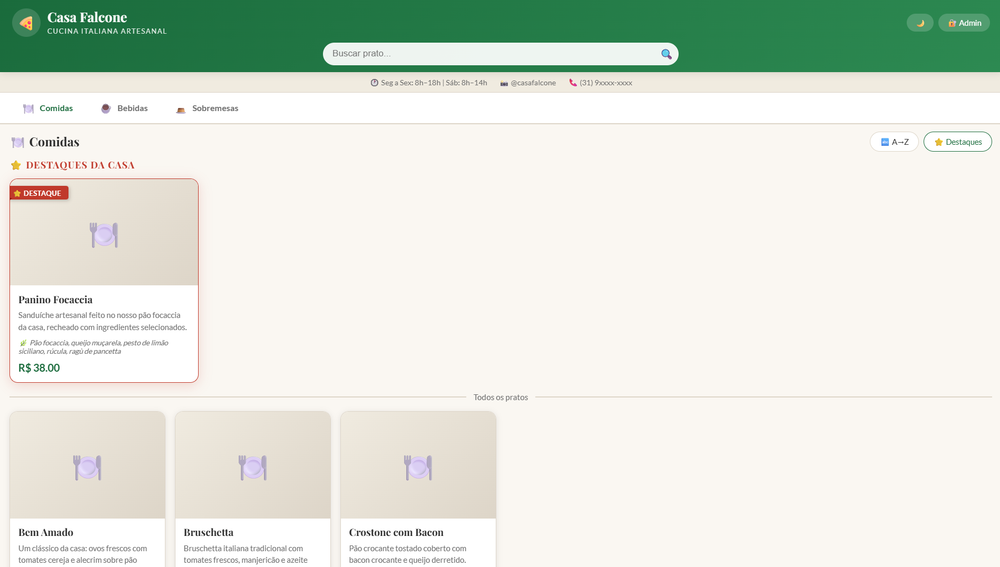
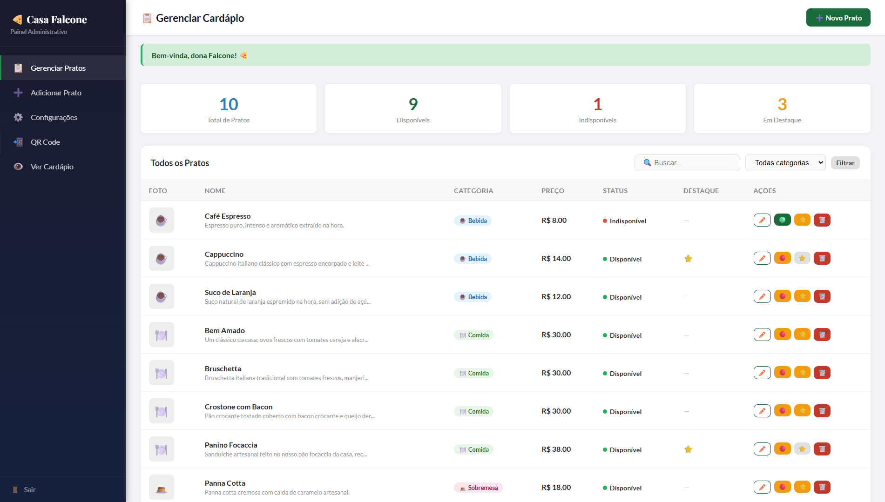
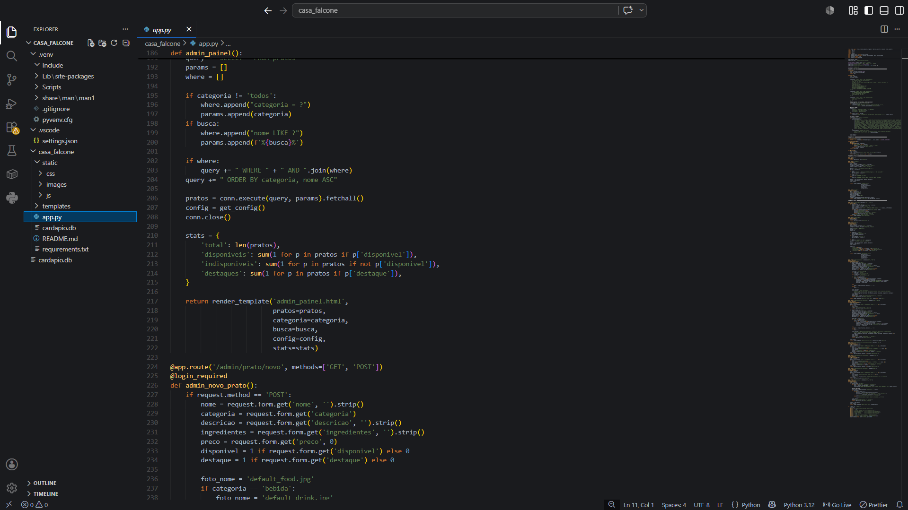

# 🍕 Casa Falcone — Sistema de Cardápio Digital

Sistema completo de cardápio digital com tema italiano para a Casa Falcone.

---

## 📸 Screenshots

**Cardápio público**


**Painel administrativo**


**Código-fonte**


---

## ✅ Como rodar no VS Code

### 1. Pré-requisitos
- Python 3.8 ou superior instalado
- Abra a pasta `casa_falcone` no VS Code

### 2. Instalar dependências

Abra o terminal no VS Code (Ctrl + `) e rode:

```bash
pip install -r requirements.txt
```

### 3. Rodar o sistema

```bash
python app.py
```

Você verá no terminal:
```
✅ Servidor rodando em: http://localhost:5000
📱 Cardápio público:   http://localhost:5000/cardapio
🔐 Painel admin:       http://localhost:5000/admin/login
📲 Gerar QR Code:      http://localhost:5000/qrcode
🔑 Login admin: usuário=admin | senha=falcone123
```

### 4. Acessar

- **Cardápio (clientes):** http://localhost:5000/cardapio
- **Painel admin (dona):** http://localhost:5000/admin/login
  - Usuário: `admin`
  - Senha: `falcone123`
  - ⚠️ **Troque a senha no painel de Configurações!**

---

## 📱 Funcionalidades

### Cardápio Público (para clientes)
- ✅ Abas: Comidas · Bebidas · Sobremesas
- ✅ Busca por nome do prato
- ✅ Ordenação A→Z ou por Destaques
- ✅ Pratos indisponíveis aparecem acinzentados
- ✅ Destaques da casa no topo
- ✅ Modo escuro/claro
- ✅ Visual temático italiano

### Painel Admin (para a dona)
- ✅ Login seguro com usuário e senha
- ✅ Adicionar novos pratos com foto
- ✅ Editar nome, descrição, ingredientes, preço, foto
- ✅ Marcar/desmarcar como Indisponível (sem apagar)
- ✅ Marcar/desmarcar como Destaque ⭐
- ✅ Apagar permanentemente (com confirmação)
- ✅ Configurar horário, telefone, Instagram
- ✅ Trocar senha do admin
- ✅ Gerar QR Code para imprimir

---

## 🖼️ Adicionando fotos

1. Acesse o painel admin: http://localhost:5000/admin/login
2. Clique em ✏️ Editar no prato desejado
3. Clique em "Escolher arquivo" no campo Foto
4. Selecione a imagem (JPG, PNG ou WebP, máx 16MB)
5. Clique em Salvar

---

## 📲 QR Code para as mesas

1. Acesse: http://localhost:5000/qrcode
2. Clique em 🖨️ Imprimir
3. Recorte e plastifique para cada mesa

> **Importante:** O QR Code aponta para o IP da sua máquina na rede.
> Para funcionar em outros dispositivos da mesma rede Wi-Fi, 
> use o endereço IP local (ex: http://192.168.1.100:5000/cardapio)
> ao invés de localhost.

---

## 🔑 Segurança

- A senha do admin é armazenada com hash seguro (werkzeug)
- Troque a senha padrão `falcone123` antes de usar em produção
- O painel admin é completamente separado do cardápio público

---

## 📁 Estrutura de arquivos

```
casa_falcone/
├── app.py                  # Servidor principal Flask
├── cardapio.db             # Banco de dados (criado automaticamente)
├── requirements.txt        # Dependências Python
├── README.md               # Este arquivo
├── assets/                 # Imagens usadas no README (screenshots)
│   ├── home.png
│   ├── dashboard.png
│   └── codigo.png
├── templates/
│   ├── cardapio.html       # Página pública do cardápio
│   ├── admin_login.html    # Login da dona
│   ├── admin_painel.html   # Painel de gerenciamento
│   ├── admin_form_prato.html  # Formulário de prato
│   ├── admin_config.html   # Configurações
│   └── qrcode.html         # Página do QR Code
└── static/
    ├── css/
    │   └── style.css       # Estilos com tema italiano
    └── images/             # Fotos dos pratos (uploads)
```

---

## 💡 Dicas para os amigos programadores

- O banco de dados é SQLite, arquivo `cardapio.db` — fácil de inspecionar com DB Browser for SQLite
- Para deploy em servidor real, substituir SQLite por PostgreSQL e usar gunicorn
- Para tornar acessível na internet, usar ngrok ou deploy em Heroku/Railway/Render
- As senhas usam `werkzeug.security` (pbkdf2:sha256) — padrão seguro da indústria
